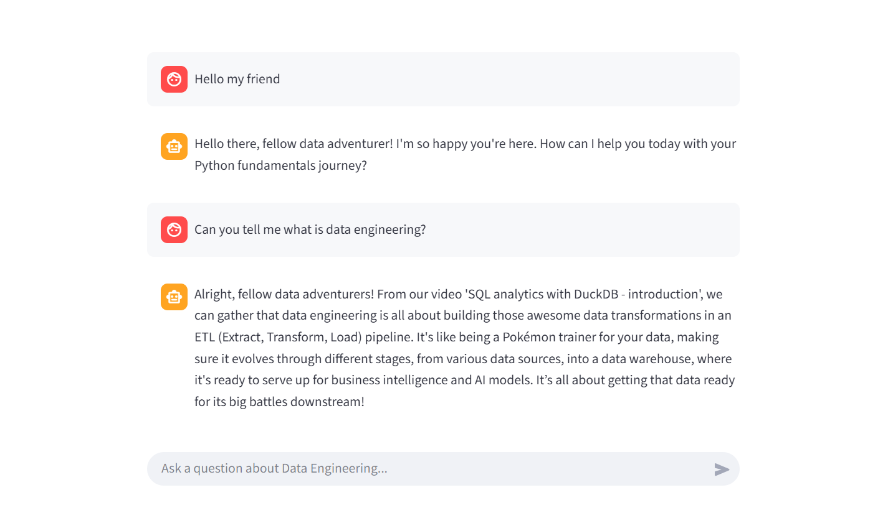

Markdown

# 🤖 YouTube RAG Chatbot (Serverless & Async)


A serverless Retrieval-Augmented Generation (RAG) chatbot designed to answer questions based on YouTube video transcripts. The bot adopts the persona of a "Nerdy Data Engineering YouTuber" (with occasional Pokémon references), making technical concepts fun and accessible.

Built with a modern data stack: **FastAPI** wrapped in **Azure Functions**, **LanceDB** for vector storage, and **Google Gemini** for generation and embeddings.



---

## 🏗 Architecture

The project follows a serverless microservices architecture:

1.  **Data Ingestion (`ingestion.py`):**
    * Parses raw Markdown transcripts.
    * Generates embeddings using **Google Gemini Embedding-001**.
    * Stores vectors and metadata locally in **LanceDB**.
2.  **Backend API (`Azure Functions` + `FastAPI`):**
    * Hosted on Azure Functions (Consumption Plan).
    * Uses **PydanticAI** for agentic workflow.
    * Retrieves relevant context from LanceDB.
    * Generates responses using **Gemini 2.5 Flash**.
3.  **Frontend (`Streamlit`):**
    * Simple chat interface to interact with the API.

---

## 🚀 Tech Stack

* **Cloud:** Microsoft Azure Functions
* **Framework:** FastAPI
* **Vector Database:** LanceDB
* **LLM & Embeddings:** Google Gemini 2.5 Flash & Gemini Embedding-001
* **Agent Framework:** PydanticAI
* **Frontend:** Streamlit
* **Dependency Management:** `uv` / `pip`

---

## 📂 Project Structure

```text
├── backend/
│   ├── constants.py      # Path configurations
│   ├── data_models.py    # Pydantic & LanceDB schemas
│   └── rag.py            # Main RAG logic & PydanticAI Agent
├── data/
│   ├── raw/              # Markdown transcripts (.md files)
│   └── lancedb/          # Generated Vector Database (Git-ignored)
├── frontend/
│   └── app.py            # Streamlit Chat UI
├── api.py                # FastAPI entry point
├── function_app.py       # Azure Functions wrapper
├── ingestion.py          # Script to create/update vector DB
├── host.json             # Azure configuration
└── requirements.txt      # Python dependencies
```
---

## 🛠️ Local Setup
#### 1. Clone the repository
   
Bash

git clone [https://github.com/your-username/youtube-rag-chatbot.git](https://github.com/your-username/youtube-rag-chatbot.git)
cd youtube-rag-chatbot

#### 2. Set up environment
It is recommended to use uv.

Bash

# Using uv (Recommended)
uv sync

# OR using pip
python -m venv .venv
source .venv/bin/activate  # On Windows: .venv\Scripts\activate
pip install -r requirements.txt
#### 3. Configure Environment Variables
Create a .env file in the root directory:

Ini, TOML

GOOGLE_API_KEY=your_google_gemini_key
API_KEY=your_azure_function_key  # Optional for local, required for Streamlit

#### 4. Build the Vector Database
Before running the app, you must ingest the data to create the LanceDB table.

Bash

python ingestion.py
This will read files from data/raw, generate embeddings via Google API, and save them to data/lancedb.

#### 5. Run Locally (Backend)
You can run the FastAPI app directly using Uvicorn:

Bash

uvicorn api:app --reload
API will be available at http://127.0.0.1:8000

#### 6. Run Frontend
In a separate terminal:

Bash

streamlit run frontend/app.py

## ☁️ Deployment to Azure
The project is configured for Azure Functions.

Prerequisites: Azure CLI and Azure Functions Core Tools installed.

Deploy:

Bash

func azure functionapp publish <YOUR_FUNCTION_APP_NAME>
Environment Variables: Set GOOGLE_API_KEY in the Azure Portal -> Settings -> Environment Variables.

## 🧪 Usage Example
User: "What is Data Engineering?"

Bot:

"Alright, fellow data adventurers! From our video 'SQL analytics with DuckDB - introduction', we can gather that data engineering is all about building those awesome data transformations in an ETL pipeline. It's like being a Pokémon trainer for your data!..."
